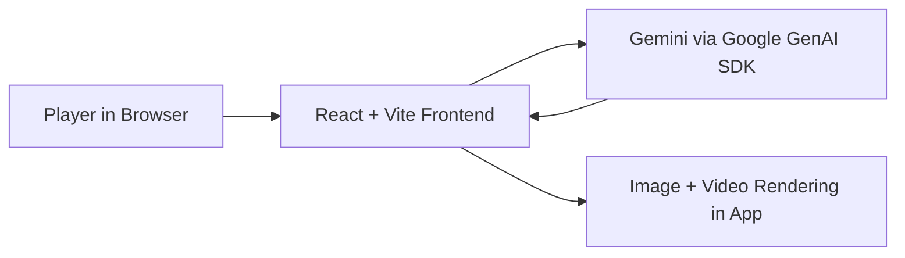

<div align="center">
  

  
  

  # Dungeons & Dragons Adventure (Voice + AI Media)

  An interactive, turn-based fantasy web app where players make choices, evolve story state, and generate scene images/videos with Gemini.
</div>

---

## 🎮 What this project does

This app is a **D&D-style narrative experience** with a lightweight game engine + GenAI pipeline:

- Create 1–4 characters with role/backstory
- Play through branching, turn-based story decisions
- Generate cinematic scene images
- Generate scene videos from the current state
- Build a video plan from gameplay logs
- Play with in-app background music and animated UI transitions

---

## ✨ Highlights

- **State-driven gameplay loop** (`GameState`, choices, logs, current player turn)
- **Gemini text generation** for story progression
- **Gemini image generation** for cover, portraits, and scenes
- **Gemini video generation** for scene animation
- **Fallback/error handling** for quota/permission issues
- **Dark-fantasy UX** with Motion-based transitions

---

## 🧱 Tech Stack

- **Frontend:** React 19, TypeScript, Vite
- **Animation/UI:** Motion, Lucide React
- **AI:** `@google/genai` (Gemini)
- **Media:** In-app `<video>` playback + BGM audio controller

---

## 🚀 Quick Start

### Prerequisites

- Node.js 18+
- A Gemini API key (with image/video access for full feature set)

### 1) Install

```bash
npm install
```

### 2) Configure environment

Create or edit `.env.local`:

```bash
GEMINI_API_KEY=your_key_here
# Optional: route story-state generation through Cloud Run backend
VITE_BACKEND_URL=https://your-cloud-run-service-url
```

> You can also use `API_KEY`, but `GEMINI_API_KEY` is preferred.

### 3) Run

```bash
npm run dev
```

Open: `http://localhost:5173`

### 4) Build / Preview

```bash
npm run build
npm run preview
```

---

## 🎬 Demo

- YouTube Demo: https://youtu.be/VU-bBSGqal0
- Sample local media assets are in `video111/` (includes `1.mp4` and scene images)

---

## 📂 Project Structure

```txt
.
├── App.tsx
├── components/
│   ├── CharacterCreation.tsx
│   ├── CoverPage.tsx
│   ├── GameDisplay.tsx
│   ├── MusicPlayer.tsx
│   └── VideoPlanModal.tsx
├── services/
│   └── geminiService.ts
├── constants.ts
├── types.ts
└── HANDBOOK.md
```

---

## 🧠 AI + Game Flow

1. User creates characters
2. App requests initial game state from Gemini
3. Player actions resolve into next `GameState`
4. Optional media generation:
   - image generation from scene context
   - video generation from image + scene prompt
5. Logs can be transformed into a cinematic video plan

---

## ⚠️ Notes & Limitations

- Image/video generation requires proper model permissions and quota.
- Video generation can be slow and may fail on quota/network issues.
- This project is demo-oriented and currently has no full automated test suite.

---

## 📘 Additional Docs

- Player guide / operational notes: [`HANDBOOK.md`](./HANDBOOK.md)

---

## 🏆 Gemini Live Agent Challenge Compliance (Creative Storyteller)

Target track: **Creative Storyteller**

### Requirement checklist

- [x] Uses a **Gemini model** (`@google/genai`, text + image + video flows)
- [x] Uses **Google GenAI SDK**
- [ ] Uses **Gemini Live API or ADK** (planned next implementation step)
- [ ] Backend hosted on **Google Cloud** (planned Cloud Run deployment)
- [ ] Uses at least one explicit **Google Cloud service** in deployed architecture (planned: Cloud Run + Vertex AI/GenAI endpoint path)
- [ ] Architecture diagram included for judges (draft added below, production version pending)
- [ ] Reproducible spin-up instructions in README (present, being expanded for Cloud path)
- [ ] <4 minute demo video showing real working multimodal features (in progress)
- [ ] Cloud deployment proof artifact (in progress)

### Current architecture (draft)



### Planned competition-ready architecture

```mermaid
flowchart LR
  U[Player in Browser] --> FE[Frontend: React/Vite]
  FE --> BE[Backend API: Cloud Run]
  BE --> GV[Gemini / Vertex AI APIs]
  BE --> OBS[Cloud Logging]
  BE --> ST[Cloud Storage (optional media/session assets)]
  GV --> BE --> FE
```

### Judge-facing deliverables in progress

1. Cloud Run backend migration for story/media orchestration
2. Gemini Live/ADK integration path for real-time multimodal interaction
3. Final architecture diagram in `/docs/architecture.md` (export image for submission upload)
4. Dedicated submission checklist + proof links section
5. Demo runbook checklist in `/docs/demo-checklist.md`

### New cloud backend scaffold (added)

- `backend/server.mjs` — Express API for server-side Gemini calls
- `backend/Dockerfile` — Cloud Run container target
- `backend/deploy-cloud-run.sh` — scripted Cloud Run deployment helper
- `backend/README.md` — local run + Cloud Run deploy command
- `scripts/setup-gcloud-mac.sh` — macOS gcloud bootstrap helper
- `docs/submission-checklist.md` — judge evidence checklist
- `docs/gcp-proof-checklist.md` — Cloud proof artifact checklist
- `docs/devpost-submission-draft.md` — ready-to-fill Devpost submission draft
- `docs/competition-requirement-matrix.md` — judge-facing requirement status + proof outputs
- `docs/audio-attribution.md` — free audio source attributions used in-game
- `docs/live-adk-implementation-plan.md` — Live API/ADK implementation roadmap

## 🔐 Privacy

This repository avoids publishing personal operational data. Keep your API keys in local env files only (`.env.local`) and never commit them.

## 🌐 Deploy (Vercel)

This app can be deployed as a Vite static site.

```bash
npm i -g vercel
vercel --prod
```

Set environment variable in Vercel Project Settings:

- `GEMINI_API_KEY` (preferred)
- or `API_KEY`

