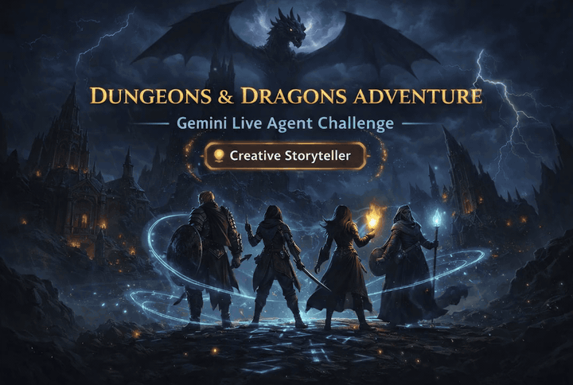
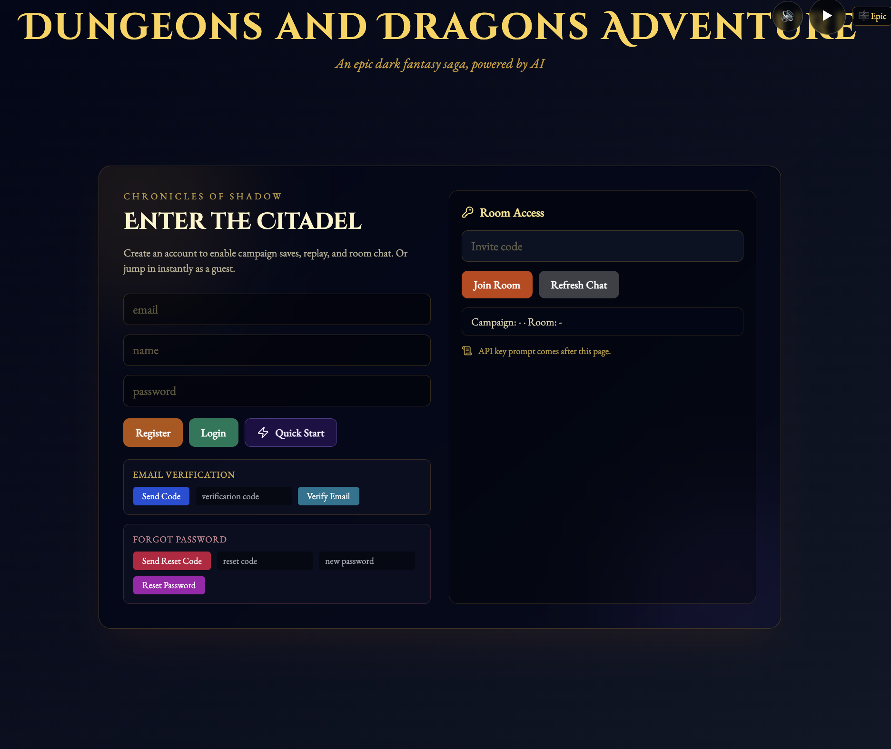
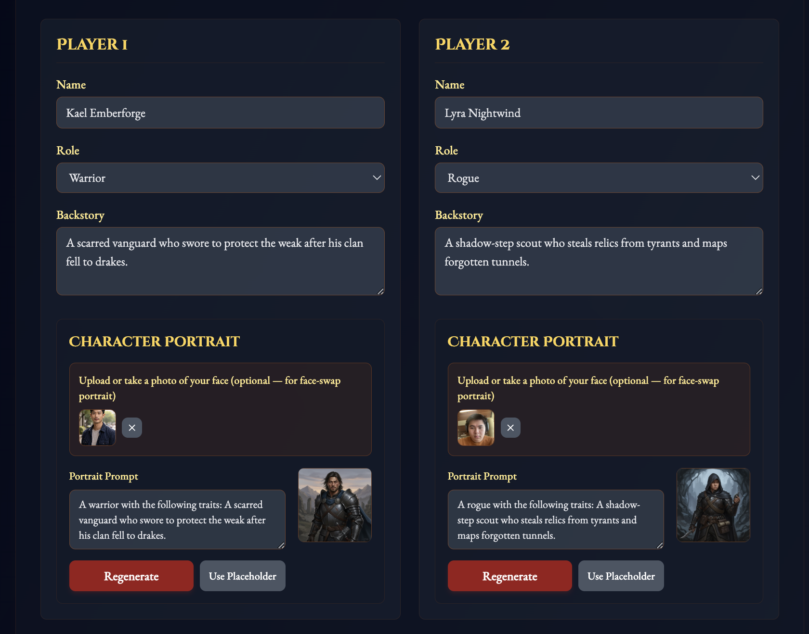
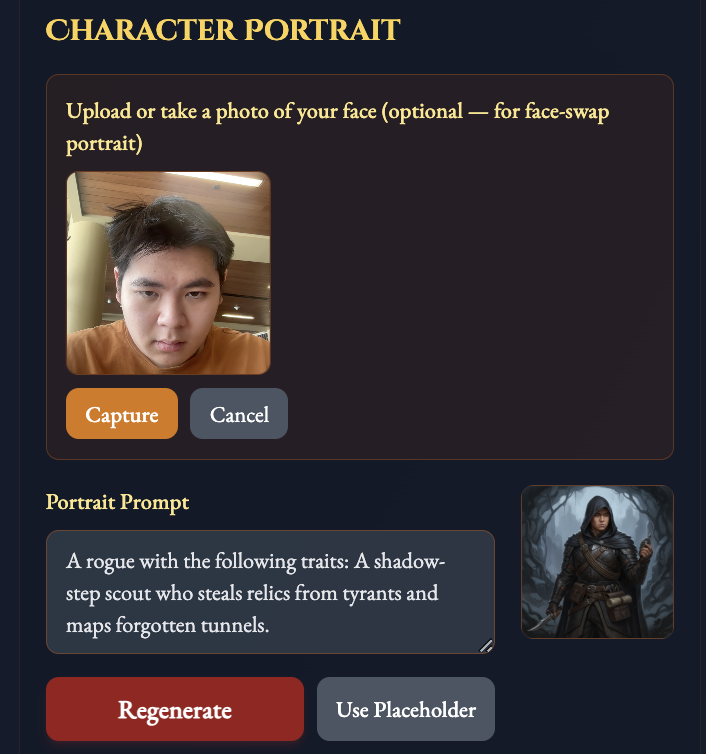
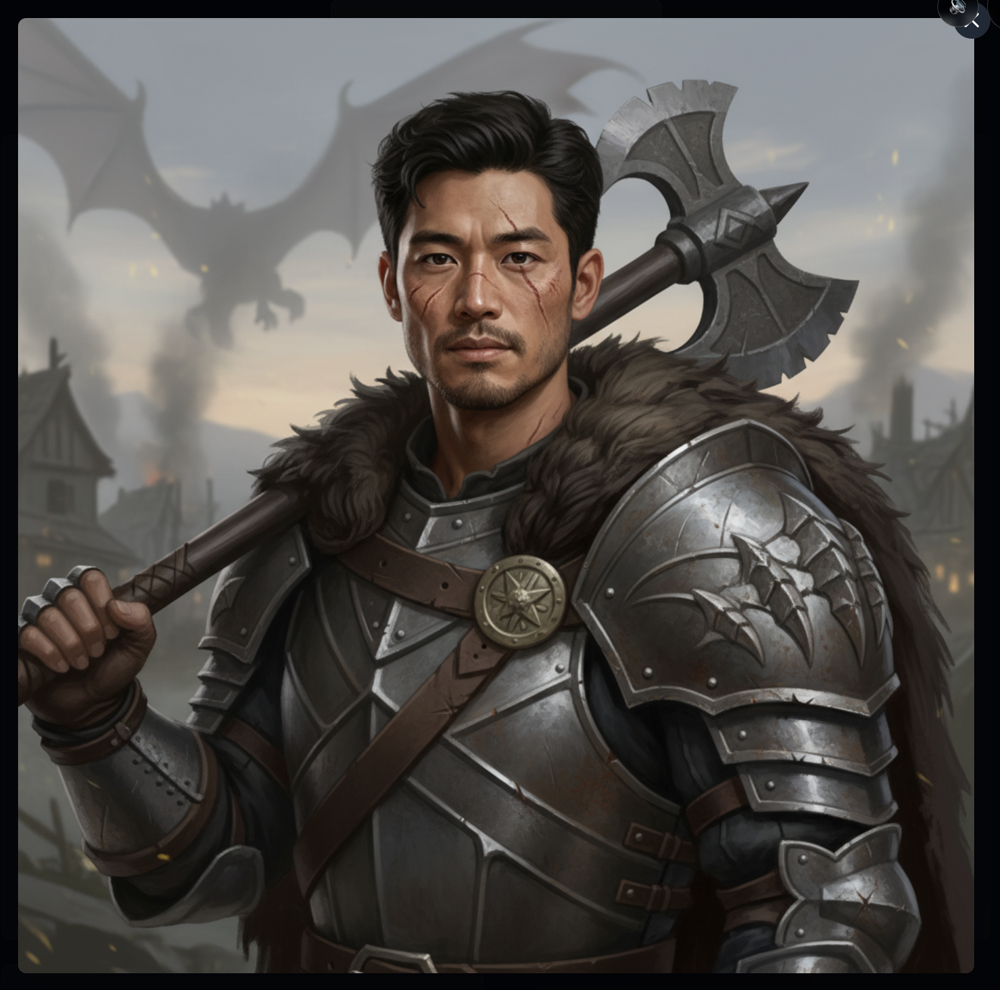

## Dungeons & Dragons Adventure — Gemini Live Agent Demo

A production-style, multimodal D&D-inspired web app where players build a party, make tactical choices, and drive an evolving AI-generated adventure with matching visuals.

Target category: Creative Storyteller (Gemini Live Agent Challenge)

### Live Links
- **App**: [Play Demo](https://dungeons-and-dragons-adventure-voic.vercel.app)  
- **Demo Video**: [Watch on YouTube](https://www.youtube.com/watch?v=e1zc7FAKn3c)

### D&D Front Page



### Table of Contents

- [Features](#features)
- [Architecture](#architecture)
- [Project Structure](#project-structure)
- [Quick Start](#quick-start)
- [Reproducible Test Instructions (Judge Guide)](#reproducible-test-instructions-judge-guide)
- [Environment Variables](#environment-variables)
- [Deployment](#deployment)
- [Gameplay Mechanics](#gameplay-mechanics)
- [Competition Submission Docs](#competition-submission-docs)
- [Troubleshooting](#troubleshooting)
- [Roadmap](#roadmap)
- [Contributing](#contributing)
- [License](#license)
- [Newly Added Features](#newly-added-features-post-readme-update)

## Features

### Core Gameplay

- Party creation (1–8 players)
- Turn-based narrative progression
- Agility-based initiative timeline (faster characters act more often)
- Branching decisions + custom free-text actions
- Dead-player logic (dead players moved to bottom, marked, skipped until revived)

### AI Systems

- Gemini-powered story generation
- Scene image generation with action-context alignment
- Cinematic video-plan generation from story logs
- Live API probe endpoint on backend (`/api/live/session`)

### UX & Reliability

- API-key onboarding state and guidance
- One-click Demo Party fast start
- Continuous tense background music + contextual SFX
- Timeout/retry handling for backend actions
- Startup/runtime fallback UI to avoid blank-screen failure

## Architecture

- Frontend: React 19, TypeScript, Vite
- Animation/UI: Motion, Lucide React
- AI SDK: `@google/genai`
- Backend: Node + Express
- Cloud Backend: Google Cloud Run
- Frontend Hosting: Vercel

See also:

- `docs/architecture.md`
- `docs/competition-requirement-matrix.md`

## Project Structure

```text
dungeons-and-dragons-adventure-voice-version/
├─ App.tsx                     # Main game shell and orchestration
├─ index.tsx                   # React entrypoint
├─ components/                 # UI/gameplay components
├─ services/                   # AI + API service integrations
├─ utils/                      # Shared helpers and pure logic
├─ backend/                    # Express backend + Cloud Run deploy scripts
├─ docs/                       # Architecture, submission, deployment docs
├─ scripts/                    # Local helper scripts
├─ public/                     # Static assets
├─ dist/                       # Build output (generated)
├─ package.json                # Frontend scripts and deps
├─ vite.config.ts              # Vite config
└─ README.md
```

## Quick Start

### Prerequisites

- Node.js 18+
- Gemini API key

### Install

```bash
npm install
```

### Run locally (recommended)

```bash
npm run dev:local
```

Open:

- `http://127.0.0.1:5173/`

### Build

```bash
npm run build
npm run preview
```

## Reproducible Test Instructions (Judge Guide)

Use these exact steps to quickly validate the project end-to-end.

### 1) Setup

```bash
git clone https://github.com/WilliamK112/dungeons-and-dragons-adventure-voice-version.git
cd dungeons-and-dragons-adventure-voice-version
npm install
cp .env.example .env.local
```

Set your API key in `.env.local`:

```bash
GEMINI_API_KEY=your_key_here
```

### 2) Run locally

```bash
npm run dev:local
```

Open:

- `http://127.0.0.1:5173/`

### 3) Core test flow (3–5 minutes)

- Start with Demo Party (or create 2–4 players).
- Trigger one turn and confirm story text updates.
- Select an action and verify the turn advances.
- Confirm initiative order updates based on agility/speed.
- Verify an image is generated for the scene.

### 4) Expected observable results

- Story log grows each turn.
- Action labels appear (`[Action]`, `[Move]`, `[Bonus]`, `[Reaction]`).
- Initiative timeline updates and dead players are skipped.
- Scene image aligns with recent narrative context.
- No blank-screen failure during startup/runtime.

### 5) Optional backend probe check

If backend is deployed, verify live session endpoint:

```bash
curl -s https://<your-cloud-run-service>/api/live/session
```

Expected: JSON response (non-HTML) indicating live endpoint availability.

### 6) Build reproducibility check

```bash
npm run build
npm run preview
```

If build succeeds and the core flow above works, the demo is reproducible.

## Environment Variables

Create `.env.local` in the project root:

```bash
GEMINI_API_KEY=your_key_here
# Optional: route game command calls through deployed cloud backend
VITE_BACKEND_URL=https://your-cloud-run-service-url
# Optional TTS routing preference (default set to cosyvoice in app service call)
VITE_TTS_PROVIDER=cosyvoice
VITE_TTS_FALLBACK_PROVIDER=openai
```

## Deployment

### Frontend (Vercel)

```bash
vercel --prod
```

### Backend (Cloud Run)

From `backend/`:

```bash
PROJECT_ID=<your-project> REGION=us-central1 SERVICE_NAME=dnd-gemini-backend GEMINI_API_KEY='<your_key>' ./deploy-cloud-run.sh
```

Deployment helpers:

- `backend/deploy-cloud-run.sh`
- `scripts/setup-gcloud-mac.sh`
- `docs/cloud-deploy-now.md`
- `docs/gcp-proof-checklist.md`

## Gameplay Mechanics

- Initiative: speed-based timeline (not simple round-robin)
- Action outcomes: d20-style roll logging (`[ROLL] ...`)
- Action economy labels: `[Action]`, `[Move]`, `[Bonus]`, `[Reaction]`
- Death state: dead players are visually marked and removed from actionable turn flow
- Revival: possible via explicit resurrection attempts with cost/tradeoff

## Competition Submission Docs

- `docs/submission-checklist.md`
- `docs/devpost-submission-draft.md`
- `docs/competition-requirement-matrix.md`
- `docs/demo-checklist.md`
- `docs/live-adk-implementation-plan.md`

## Troubleshooting

- If local localhost behaves oddly, use `http://127.0.0.1:5173/`.
- If the page looks blank/stale, hard refresh (Cmd + Shift + R).
- Ensure `GEMINI_API_KEY` is set if story/image generation fails.
- Keep keys out of Git.

## Roadmap

- Expand combat fidelity (conditions, richer AC/DC semantics)
- Add class-specific abilities/resources with stronger tactical identity
- Improve observability for cloud runtime and gameplay diagnostics

## Contributing

PRs and issue reports are welcome.

Suggested contribution flow:

- Fork + create feature branch
- Make scoped changes
- Run:

```bash
npm run lint
npm run build
```

- Open PR with before/after notes

## Media & Attribution

- Audio attribution: `docs/audio-attribution.md`
- Screenshot placeholders (add later):
  - `docs/screenshots/cover.png`
  - `docs/screenshots/gameplay.png`
  - `docs/screenshots/initiative.png`

## License

MIT (or your preferred license)

---

<details>
<summary>Raw GitHub page text (as provided)</summary>

```text
Skip to content
WilliamK112
dungeons-and-dragons-adventure-voice-version
Repository navigation
Code
Issues
Pull requests
Agents
Actions
Projects
Wiki
Security
Insights
Settings
Owner avatar
dungeons-and-dragons-adventure-voice-version
Public
WilliamK112/dungeons-and-dragons-adventure-voice-version
Go to file
t
Name
WilliamK112
WilliamK112
docs: replace README frontpage image with imageDandD-frontpage11
0ae4215
 ·
11 hours ago
backend
feat: improve narration flow and backend TTS integration
3 days ago
components
Add immersive success page + victory background and update demo link
yesterday
docs
feat(combat): dead players moved to bottom, marked with red X, death …
4 days ago
public
docs: replace README frontpage image with imageDandD-frontpage11
11 hours ago
scripts
feat: improve demo UX, planning flow, and player layout
3 days ago
services
feat: improve narration flow and backend TTS integration
3 days ago
utils
fix(interaction): restore dead-state turn filtering and resolve non-r…
4 days ago
video111
Add scene images 11 and 22 to README demo section
last week
.env.example
docs: add env template and Vercel deploy instructions
4 days ago
.gitignore
feat: improve narration flow and backend TTS integration
3 days ago
App.tsx
Add immersive success page + victory background and update demo link
yesterday
HANDBOOK.md
Add player handbook for D&D adventure app
2 weeks ago
README.md
docs: replace README frontpage image with imageDandD-frontpage11
11 hours ago
constants.ts
feat: improve demo UX, planning flow, and player layout
3 days ago
index.html
fix(startup): add persistent boot fallback UI and auto-remove on succ…
4 days ago
index.tsx
fix(startup): remove fallback only after App mounts to avoid blank bl…
4 days ago
metadata.json
Initial commit: dungeons-and-dragons-adventure-voice-version
2 weeks ago
package-lock.json
feat: improve demo UX, planning flow, and player layout
3 days ago
package.json
feat: improve demo UX, planning flow, and player layout
3 days ago
tsconfig.json
Initial commit: dungeons-and-dragons-adventure-voice-version
2 weeks ago
types.ts
Initial commit: dungeons-and-dragons-adventure-voice-version
2 weeks ago
vite.config.ts
Initial commit: dungeons-and-dragons-adventure-voice-version
2 weeks ago
Repository files navigation
README
Dungeons & Dragons Adventure — Gemini Live Agent Demo
Frontend Backend Cloud License

A production-style, multimodal D&D-inspired web app where players build a party, make tactical choices, and drive an evolving AI-generated adventure with matching visuals.

Target category: Creative Storyteller (Gemini Live Agent Challenge)

Live Links
App: https://dungeons-and-dragons-adventure-voic.vercel.app
Demo Video: https://www.youtube.com/watch?v=e1zc7FAKn3c
D&D Front Page

Table of Contents
Features
Architecture
Project Structure
Quick Start
Reproducible Test Instructions (Judge Guide)
Environment Variables
Deployment
Gameplay Mechanics
Competition Submission Docs
Troubleshooting
Roadmap
Contributing
License
Features
Core Gameplay
Party creation (1–8 players)
Turn-based narrative progression
Agility-based initiative timeline (faster characters act more often)
Branching decisions + custom free-text actions
Dead-player logic (dead players moved to bottom, marked, skipped until revived)
AI Systems
Gemini-powered story generation
Scene image generation with action-context alignment
Cinematic video-plan generation from story logs
Live API probe endpoint on backend (/api/live/session)
UX & Reliability
API-key onboarding state and guidance
One-click Demo Party fast start
Continuous tense background music + contextual SFX
Timeout/retry handling for backend actions
Startup/runtime fallback UI to avoid blank-screen failure
Architecture
Frontend: React 19, TypeScript, Vite
Animation/UI: Motion, Lucide React
AI SDK: @google/genai
Backend: Node + Express
Cloud Backend: Google Cloud Run
Frontend Hosting: Vercel
See also:

docs/architecture.md
docs/competition-requirement-matrix.md
Project Structure
dungeons-and-dragons-adventure-voice-version/
├─ App.tsx                     # Main game shell and orchestration
├─ index.tsx                   # React entrypoint
├─ components/                 # UI/gameplay components
├─ services/                   # AI + API service integrations
├─ utils/                      # Shared helpers and pure logic
├─ backend/                    # Express backend + Cloud Run deploy scripts
│  ├─ index.js
│  ├─ routes/
│  └─ deploy-cloud-run.sh
├─ docs/                       # Architecture, submission, deployment docs
├─ scripts/                    # Local helper scripts
├─ public/                     # Static assets
├─ dist/                       # Build output (generated)
├─ package.json                # Frontend scripts and deps
├─ vite.config.ts              # Vite config
└─ README.md
Quick Start
Prerequisites
Node.js 18+
Gemini API key
Install
npm install
Run locally (recommended)
npm run dev:local
Open:

http://127.0.0.1:5173/
Build
npm run build
npm run preview
Reproducible Test Instructions (Judge Guide)
Use these exact steps to quickly validate the project end-to-end.

1) Setup
git clone https://github.com/WilliamK112/dungeons-and-dragons-adventure-voice-version.git
cd dungeons-and-dragons-adventure-voice-version
npm install
cp .env.example .env.local
Set your API key in .env.local:

GEMINI_API_KEY=your_key_here
2) Run locally
npm run dev:local
Open:

http://127.0.0.1:5173/
3) Core test flow (3–5 minutes)
Start with Demo Party (or create 2–4 players).
Trigger one turn and confirm story text updates.
Select an action and verify the turn advances.
Confirm initiative order updates based on agility/speed.
Verify an image is generated for the scene.
4) Expected observable results
Story log grows each turn.
Action labels appear ([Action], [Move], [Bonus], [Reaction]).
Initiative timeline updates and dead players are skipped.
Scene image aligns with recent narrative context.
No blank-screen failure during startup/runtime.
5) Optional backend probe check
If backend is deployed, verify live session endpoint:

curl -s https://<your-cloud-run-service>/api/live/session
Expected: JSON response (non-HTML) indicating live endpoint availability.

6) Build reproducibility check
npm run build
npm run preview
If build succeeds and the core flow above works, the demo is reproducible.

Environment Variables
Create .env.local in the project root:

GEMINI_API_KEY=your_key_here
# Optional: route game command calls through deployed cloud backend
VITE_BACKEND_URL=https://your-cloud-run-service-url
# Optional TTS routing preference (default set to cosyvoice in app service call)
VITE_TTS_PROVIDER=cosyvoice
VITE_TTS_FALLBACK_PROVIDER=openai
Deployment
Frontend (Vercel)
vercel --prod
Backend (Cloud Run)
From backend/:

PROJECT_ID=<your-project> REGION=us-central1 SERVICE_NAME=dnd-gemini-backend GEMINI_API_KEY='<your_key>' ./deploy-cloud-run.sh
Deployment helpers:

backend/deploy-cloud-run.sh
scripts/setup-gcloud-mac.sh
docs/cloud-deploy-now.md
docs/gcp-proof-checklist.md
Gameplay Mechanics
Initiative: speed-based timeline (not simple round-robin)
Action outcomes: d20-style roll logging ([ROLL] ...)
Action economy labels: [Action], [Move], [Bonus], [Reaction]
Death state: dead players are visually marked and removed from actionable turn flow
Revival: possible via explicit resurrection attempts with cost/tradeoff
Competition Submission Docs
docs/submission-checklist.md
docs/devpost-submission-draft.md
docs/competition-requirement-matrix.md
docs/demo-checklist.md
docs/live-adk-implementation-plan.md
Troubleshooting
If local localhost behaves oddly, use http://127.0.0.1:5173/.
If the page looks blank/stale, hard refresh (Cmd + Shift + R).
Ensure GEMINI_API_KEY is set if story/image generation fails.
Keep keys out of Git.
Roadmap
Expand combat fidelity (conditions, richer AC/DC semantics)
Add class-specific abilities/resources with stronger tactical identity
Improve observability for cloud runtime and gameplay diagnostics
Contributing
PRs and issue reports are welcome.

Suggested contribution flow:

Fork + create feature branch
Make scoped changes
Run:
npm run lint
npm run build
Open PR with before/after notes
Media & Attribution
Audio attribution: docs/audio-attribution.md
Screenshot placeholders (add later):
docs/screenshots/cover.png
docs/screenshots/gameplay.png
docs/screenshots/initiative.png
License
MIT (or your preferred license)

About
No description, website, or topics provided.
Resources
 Readme
 Activity
Stars
 1 star
Watchers
 0 watching
Forks
 0 forks
Releases
No releases published
Create a new release
Packages
No packages published
Publish your first package
Contributors
1
@WilliamK112
WilliamK112 Ching Wei Kang
Languages
TypeScript
88.0%

JavaScript
6.2%

Shell
3.6%

HTML
2.1%

Dockerfile
0.1%
Suggested workflows
Based on your tech stack
Webpack logo
Webpack
Build a NodeJS project with npm and webpack.
SLSA Generic generator logo
SLSA Generic generator
Generate SLSA3 provenance for your existing release workflows
Datadog Synthetics logo
Datadog Synthetics
Run Datadog Synthetic tests within your GitHub Actions workflow
More workflows
Footer
© 2026 GitHub, Inc.
Footer navigation
Terms
Privacy
Security
Status
Community
Docs
Contact
Manage cookies
Do not share my personal information
```
</details>

## Newly Added Features (Post-README Update)

The following capabilities were added after the original README draft and are now part of the current project(3/16/2026):
### 1) User Account/Auth Module

- Auth flow is: register account (`/api/auth/register`) -> send/confirm verification code (`/api/auth/send-verification`, `/api/auth/verify-email`) -> login (`/api/auth/login`) to receive a signed Bearer token.
- Password recovery flow is handled by `/api/auth/forgot-password` and `/api/auth/reset-password`, using time-limited numeric codes.
- The token is required by protected endpoints and is sent as `Authorization: Bearer <token>` for campaign and room features.
- After login, each user gets isolated data scope for campaign create/list/resume/state save/replay (`/api/campaigns*`) and multiplayer room membership/chat (`/api/rooms*`).
- Backend persistence is stored in SQLite (users, campaigns, game states, turn logs, dice rolls, rooms, members, and chat messages), so progress can be resumed across sessions.
- Apps/APIs/services used: React frontend form UI, Node.js + Express backend APIs, `better-sqlite3` local database, `dotenv` environment loading, and optional email delivery via Resend API (fallback to console log in local mode).
- **Configure real email:** `backend/SETUP.md`, then `cd backend && npm run email:check`.



### 2) Face-Swap to Game Character Module

- Adds a dedicated face-swap/avatar pipeline to map a user face onto a game-style character presentation.
- Included as a separate app module I created today in `faceswap-avatar-studio/` for focused development and testing.
- Allows users to upload a picture or capture a real-time photo with their camera, then build a game character with a face similar to the uploaded/captured image.
- Intended to improve player immersion by personalizing character visuals beyond default generated art. Demo pictures are shown below.
- Apps/APIs/services used: browser Camera API (`navigator.mediaDevices.getUserMedia`) for live capture, Canvas API for square crop/export, FileReader API for upload input, and Google Gemini API via `@google/genai` (`gemini-2.5-flash-image`) for image generation with identity-preserving prompts.

<p align="center">
  
  
</p>

<p align="center">
  
  
</p>

